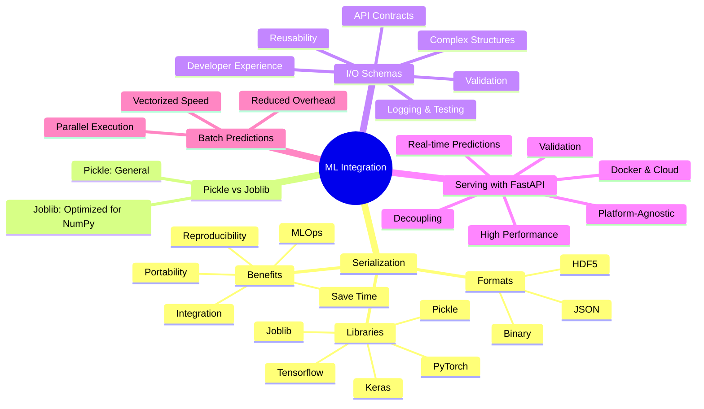

# 📘 Machine Learning Integration

# 🧠 Mind Map: ML Integration




This README summarizes **Module 5 notes** and presents the content in a clean, developer-friendly way with a **mind map**.

---

## 🗂 Topics Covered
1. Model Serialization
2. Pickle vs Joblib
3. Designing Model I/O Schemas
4. Serving ML Models with FastAPI
5. Handling Batch Predictions

---

## 🔹 1. Model Serialization
**Definition:** Converting a trained ML model into a byte stream that can be saved and later reloaded without retraining.

### 🔧 Common Libraries
- Pickle
- Joblib
- Keras (`.h5`, `.keras`)
- Tensorflow (SavedModel)
- PyTorch (`.pt`, `.pth`)

### 📂 Common Formats
- JSON
- Binary
- HDF5

### 🎯 Why Important?
- **Saves Time & Resources** → No need to retrain each time.
- **Portability** → Move across machines, OS, or cloud.
- **Reproducibility** → Ensures consistent results.
- **Integration** → Serve via REST APIs, dashboards, or edge devices.
- **MLOps** → Enables model versioning, CI/CD pipelines.

---

## 🔹 2. Pickle vs Joblib
- **Pickle** → General serialization (slower for large NumPy arrays).
- **Joblib** → Optimized for NumPy arrays, faster for ML models.

👉 **Recommendation:** Use **Joblib** for ML models, Pickle for lightweight objects.

---

## 🔹 3. Designing Model I/O Schemas
### ✅ Benefits
- **Validation & Safety** → Ensures clean inputs.
- **Clear Contracts** → Defines API input/output.
- **Better DX** → Swagger UI auto-docs.
- **Reusable & Clean Code** → Less guesswork.
- **Handles Complex Data** → Nested JSON, optional fields.
- **Auditing & Logging** → Easier debugging/testing.

**Example with FastAPI & Pydantic:**
```python
from pydantic import BaseModel

class InputSchema(BaseModel):
    x: float

class OutputSchema(BaseModel):
    prediction: float
```

---

## 🔹 4. Serving ML Models with FastAPI
### 🚀 Why FastAPI?
- Decouples ML logic from business/UI.
- Real-time predictions via `/predict`.
- Platform-agnostic REST API.
- High-performance (async, ASGI).
- Built-in validation (Pydantic).
- Docker & Cloud friendly.

**Example:**
```python
from fastapi import FastAPI
from pydantic import BaseModel
import joblib

model = joblib.load("model.pkl")
app = FastAPI()

class Input(BaseModel):
    x: float

@app.post("/predict")
def predict(data: Input):
    return {"prediction": model.predict([[data.x]])[0]}
```

---

## 🔹 5. Handling Batch Predictions
### ⚡ Why Batch?
- More efficient than single predictions.
- Uses optimized linear algebra (parallelized CPU/GPU).
- Reduces I/O overhead.

**Example:**
```python
from typing import List

class BatchInput(BaseModel):
    inputs: List[float]

@app.post("/batch_predict")
def batch_predict(data: BatchInput):
    results = model.predict([[x] for x in data.inputs])
    return {"predictions": results.tolist()}
```

---


---

✨ **This README can be used as project documentation or GitHub notes for Module 5.**

[]
